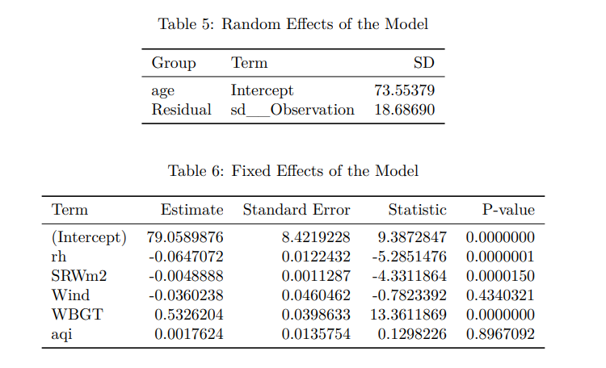

# Practical Data Analysis Portfolio

## Project 1: An Exploratory Data Analysis on Environmental Condition and Marathon Performance

### Project Description
This project a collaboration with Dr. Brett Romano Ely and Dr. Matthew Ely from the Department of Health Sciences at Providence College, aims to analyze the impact of environmental conditions on marathon performance, focusing on the interaction between age, gender, and weather-related factors. Using a dataset collected from five major U.S. marathons—Boston, Chicago, New York City, Twin Cities, and Grandma’s over a period of 15-20 years, the study investigates how variables such as Wet Bulb Globe Temperature (WBGT), solar radiation, relative humidity, wind speed, and air quality influence marathon runners' performance.

The performance outcome is measured as the percentage deviation from the course record (%CR), and the analysis is stratified by age and gender. The project also incorporates a new classification of age groups to better reflect the distribution of marathon participants. Through exploratory data analysis and statistical modeling, the project explores how environmental conditions impact performance differently across age groups and genders, with a particular focus on understanding the sensitivity of younger and older runners to these conditions.

### Methods
This report is a collaboration with Dr. Brett Romano Ely and Dr. Matthew Ely from the Department of Health Sciences at Providence College, which explores how environmental conditions, age, and sex would influence runner’s performance in this long-distance race. Their prior research found that warmer temperature leads to decline in performance in marathon races, and this decline in endurance performance varies significantly between females and males. Moreover, older adults face more thermoregulatory challenges during exercise, which further exacerbate performance declines under warmer temperature. This exploratory analysis study aims to build on previous findings, providing deeper insight by investigating the intersection of age, sex, and environmental conditions on runners’ marathon performance.

### Results

Through exploratory data analysis and statistical modeling, we concludes that age plays a significant role in runner’s performance. Highest, Upper-mid, and younger, aged runners perform worse, especially for senior in the highest age group. Moreover, male runners show more sensitivity to age change compared to female runners, with a steeper decline in
performance as age increases. Environmental conditions like Wet Bulb Global Temperature (WBGT), relative humidity (rh), and solar radiation (SRWm2) show statistically significant effect on people’s performance where WBGT has the largest impact with smaller p-value and larger coefficient estimates. Wind speed (Wind) and air quality (aqi) do not significantly affect runner’s performance. Despite the significance of these factors, people in the highest, upper-mid, and younger age group consistently show more fluctuations as environment changes compared to people in the lower-mid and mid age group. In addition, female runners exhibit more stable performance compared to male runners within the same aging group. The full report can be found [here](Project1/Report/Project-1-Codebook.pdf).

### Files
- Folder `Report`:
     - `Project 1 codebook.rmd`: The Rmarkdown file of this Exploratory Data Analysis report, containing codes and analysis text.
     - `Project 1 codebook.pdf`: The pdf file of this Exploratory Data Analysis report, including the analysis text, code results, and appendix.
 

### Dependencies

The following R version and packages are used in this analysis. Ensure that they are installed and loaded to successfully run the code:
- **R version**: 4.3.1 (2023-06-16)
    - **Platform**: x86_64-w64-mingw32/x64 (64-bit)

- **R Packages**: 
    - tidyverse - 2.0.0
    - ggplot2 - 3.5.1
    - visdat - 0.6.0
    - gtsummary - 1.7.2
    - kableExtra - 1.4.0
    - ggpubr - 0.6.0
    - gt - 0.10.1
    - car - 3.1-2
    - lme4 - 1.1-35.1
    - lmerTest - 3.1-3
    - corrplot - 0.92
    - broom.mixed_0.2.9.5

## Project 2: Influence of Baseline Characteristics on Smoking Cessation in MDD: A Study of Behavioral and Pharmacological Treatment Effects 

### Project Description

This study investigates the impact of baseline characteristics on smoking cessation outcomes in adults with Major Depressive Disorder (MDD), focusing on the effects of both behavioral and pharmacological treatments. Conducted in collaboration with Dr. George Papandonatos, this study employs a 2 × 2 factorial, randomized, placebo-controlled design to assess Behavioral Activation for Smoking Cessation (BASC) versus standard treatment (ST) and varenicline versus placebo. The goal is to identify baseline predictors of abstinence and explore how certain characteristics may moderate the effects of treatment, contributing to more effective smoking cessation interventions for individuals with MDD.

### Methods

Our sample population consists of 300 adult smokers with or previously with MDD. Patients were randomly assigned to either behavioral activation for smoking cessation (BASC) or standard behavioral treatment (ST) and either varenicline or placebo groups. That is, participants were assigned to four distinct intervention groups, including ST + placebo, ST + varenicline, BASC + placebo, and BASC + varenicline. Randomization was stratified by clinical site, sex, and level of depressive symptoms to ensure balanced representation across these factors.
Follow-up data was collected at week 27 to assess smoking cessation outcomes, along with relevant baseline
characteristics. Key variables include smoking abstinence status, demographic characteristics (sex, age,
income, and education), smoking behaviors (number of cigarettes per day, time to first cigarette after getting up, and nicotine dependence score), and psychiatric measures (MDD status, anhedonia score, other diagnoses, and antidepressant usage).

To analyze the impact of behavioral treatment on end-of-treatment abstinence and examine the moderating role of baseline characteristics, we selected Lasso regression as our primary model. Lasso was chosen for its ability to perform both variable selection and regularization, making it particularly suited for our study, which involves numerous baseline predictors and interaction terms. By applying an L1 penalty, Lasso shrinks less relevant coefficients to zero, effectively selecting a subset of the most influential predictors and interactions. 
 
### Results 

Control for treatment and other factors, as predictors, higher nicotine dependence (higher FTCD score), higher pleasurable events scale score, and current MDD status both associate with lower likelihood of abstinence. Conversely, having faster nicotine metabolism (higher NMR in log scale) was associated with higher odds of abstinence, adjusting for treatment and other factors.

Additionally, race emerged as both a predictor and moderator, with Non-Hispanic White participants showing higher odds of abstinence and a greater benefit from BASC compared to other racial groups. Menthol cigarette use and income level also moderated the effects of BASC, with menthol users experiencing lower abstinence odds and individuals with incomes between \$35,001 and \$50,000 benefiting more from BASC. Furthermore, significant interaction terms with varenicline suggest that the efficacy of pharmacotherapy varies by factors like cigarette reward value, education, race, sex, and age. 

### Files
     - `MDD Smoking Cessation Regression Analysis.Rmd`: The Rmarkdown file of this Regression Analysis report, containing codes and analysis text.
     - `MDD Smoking Cessation Regression Analysis.pdf`: The pdf file of this Exploratory Data Analysis report, including the analysis text, code results, and appendix.
     - `references.bib`: Reference list file
     - `apa-numeric-superscript.csl`: Reference Style csl.
 

The following R version and packages are used in this analysis. Ensure that they are installed and loaded to successfully run the code:
- **R version**: 4.3.1 (2023-06-16)
    - **Platform**: x86_64-w64-mingw32/x64 (64-bit)
- **R Packages**:
     - tidyverse - 2.0.0
     - mice - 3.16.0
     - gt - 0.10.1
     - gtsummary - 1.7.2
     - kableExtra - 1.4.0
     - RColorBrewer - 1.1-3
     - scico - 1.5.0
     - caret - 6.0-94
     - glmnet - 4.1-8
     - pROC - 1.18.5
     - predtools - 0.0.3
     - gridExtra - 2.3
     - ggpubr - 0.6.0
     - patchwork - 1.2.0
     - e1071 - 1.7-14
     - corrplot - 0.92
     - L0Learn - 2.1.0
     - MASS - 7.3-60.0.1

